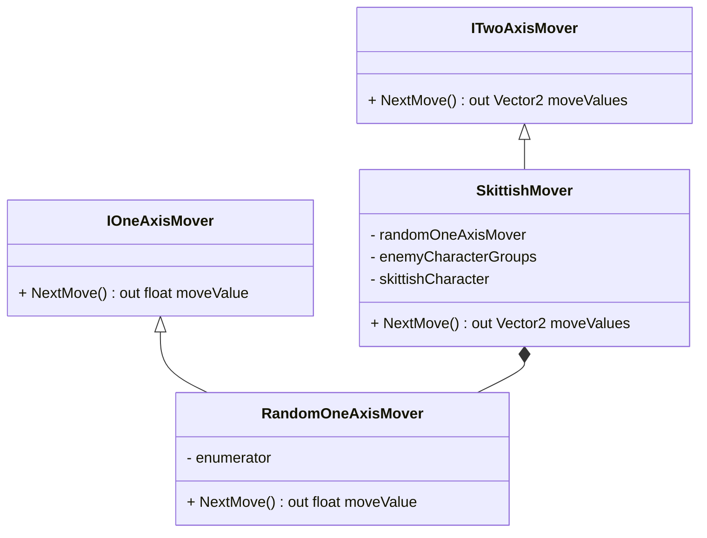

# cozygame

Blake and Diane make a cozy game!

## Class Structure

### Simulating Animal Movement

```mermaid
classDiagram
    IOneAxisMover <|-- RandomOneAxisMover
    ITwoAxisMover <|-- SkittishMover
    SkittishMover *-- RandomOneAxisMover
    
    class IOneAxisMover {
        + NextMove() out float moveValue
    }
    class ITwoAxisMover {
        + NextMove() out Vector2 moveValues
    }
    
    class RandomOneAxisMover {
        - enumerator
        + NextMove() out float moveValue
    }
    class SkittishMover {
        - randomOneAxisMover
        - enemyCharacterGroups
        - skittishCharacter
        + NextMove() out Vector2 moveValues
    }
```
